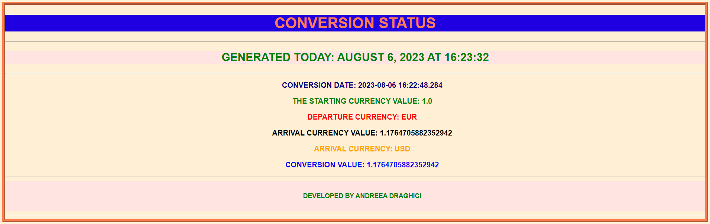

## Description

This is an GUI Application ( JavaFX based ) to convert the currency rate.

-------------------------

## Abbreviations

| Abbreviation | Description                               | 
|--------------|-------------------------------------------|
| GUI          | **G**raphical **U**ser **I**nterface      |   
| HTML         | **H**yper**T**ext **M**arkup **L**anguage |   
| JDK          | **J**ava **D**evelopment **K**it          |  
| JRE          | **J**ava  **R**untime  **E**nvironment    |

----------------------------------------

## How to run the tool

It is running via GUI.

The application also has a menu bar with two options, File and Help.

If you pressed the file option, you have the possibility to exit from application.

If you pressed the help option, you have the possibility to open the application documentation in browser.

----------------------------------------------------

## Output of application

The application generate a report html. This report contains the status of currency conversion. Below is attached the
structure of generated html report.

----------------------------------------------------------

## Limitations

- The initial implementation has the hardcoded exchange rates instead of making an API call.

-----------------------------------------------------------

## Technical aspects

- Running using JDK and JRE 1.8.
- Running using GUI functionality.

-------------------------------------------------------------

## History

- Version 1.0.0 - Initial version of application (GUI app, currency conversion, html report generation, menu bar).